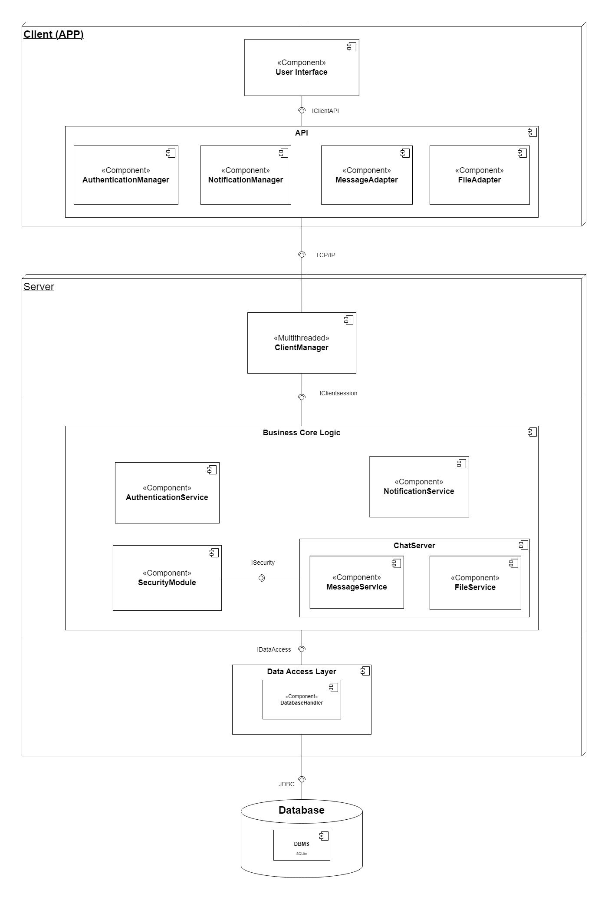

# LU CONNECT

A real-time chat application built in Java using Swing for the user interface and SQLite for data storage. LU-Connect allows users to register, log in, send messages, and share files securely.

## **Features**
- **User Authentication** → Secure login and registration with password encryption.
- **Real-Time Messaging** → Send and receive text messages instantly.
- **File Transfer** → Share files with automatic encryption and safe storage.
- **Notifications** → Get alerts for new messages, even when outside the chat window.
- **User-Friendly Interface** → Dark-themed UI with message bubbles and visual indicators.

## ** How to run it **
### 1. Git clone this repo
  `git clone https://github.com/yourusername/LU-Connect.git`
  `cd LU-Connect`
### 2. Open your shell

#### Bash

`\.gradlew build`

`\.gradlew run`

#### Powershell or CMD

`gradlew build`

`gradlew run`

#### Linux, MacOs

`./gradlew build`

`./gradlew run`

## System Architecture

## System Interaction

.jpg)
.jpg)
.jpg)
.jpg)

